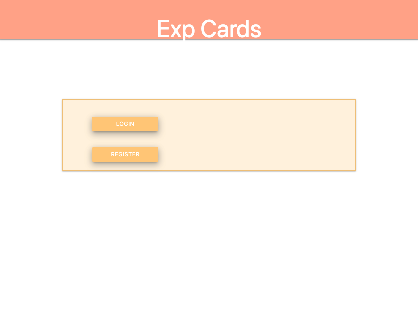
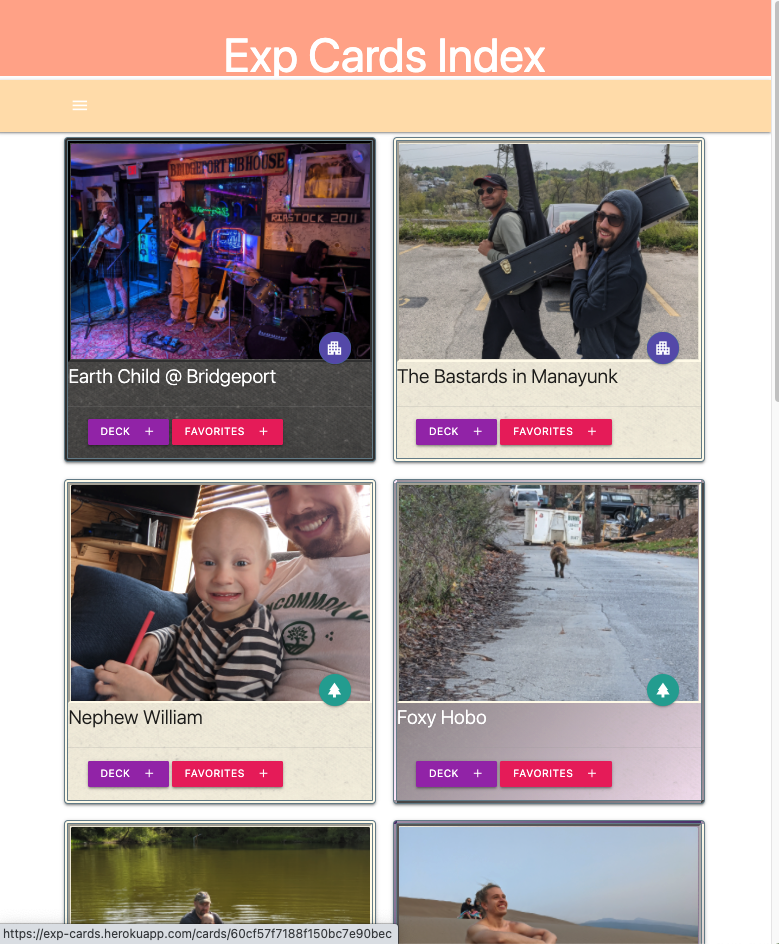
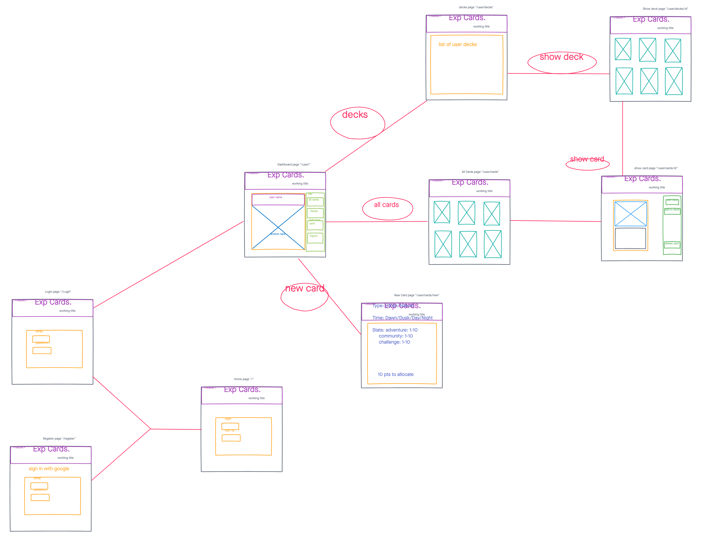
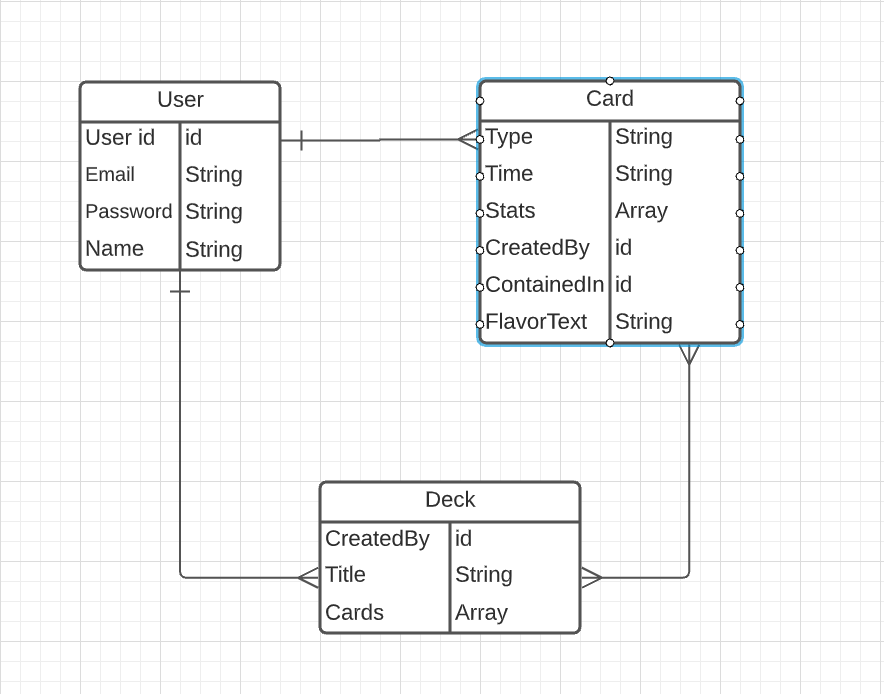

# Exp Cards
a spin on social media to gamify and create a more unique and personal sharing experience through a playing card format. 

------
## Technologies
- HTML 5
- CSS3 
- Node.js
- Mongoose/MongoDB
- EJS 
- Bcrypt

---
## Screenshots

### Wire-frames

### ERD

---
## Getting Started
[click here](https://exp-cards.herokuapp.com/) to see the working app
## Future Enhancements
- sorting cards into decks based on user selection, favoriting, and most recently added.
- add a random card slideshow to the dashboard.
- create terms of use to prevent copywritten material from being submited by users.
- develop game mode for users to interact with eachothers exp cards. 